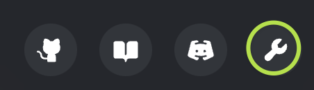
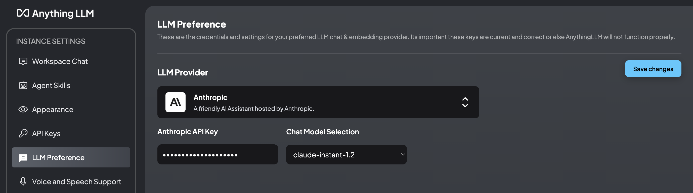
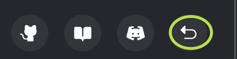
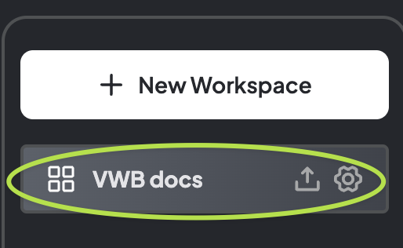
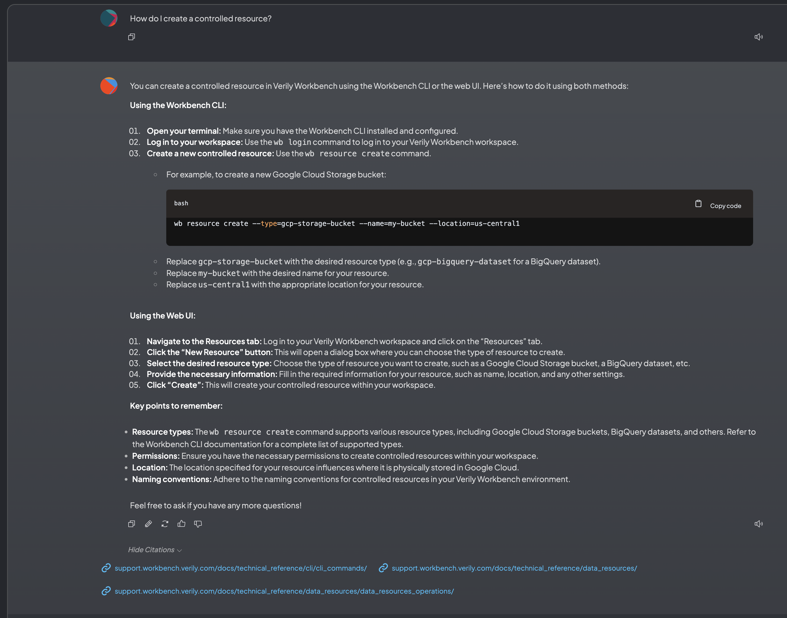

# Custom app for LLM-based docs Q&A

This custom app answers questions about Verily Workbench, based on the [docs
site](https://support.workbench.verily.com/docs/) content. It does this by taking scraped content
from the docs website, breaking it into chunks, and converting the chunks into embeddings.
It then uses its embedding database to find docs site content that might help answer a given question.
Then, it feeds that info to the prompt context for the LLM, and from that generates the answer.

The LLM setup needs configuration before use, as described in more detail below.  I was wary of
baking in an LLM API key to the container image.

The app is based on <https://github.com/Mintplex-Labs/anything-llm>.  It's possible to run this app
locally as well as a custom app, as described below.

The Dockerfile is included in this dir for completeness, but to build it, it's required to have
created a local anything-llm 'storage' directory by first running the app locally. Its base image is
the `mintplexlabs/anythingllm:latest` image.

To build the image, the app was run locally first, to initialize the app state by pulling in the
docs site web pages and building the embedding db. Then the resultant 'storage' dir is copied to the
container image.
(This simple approach provides an app already set up with the docs site data, so
that the end user does not need to scrape the docs site and build the embeddings db.  There could be
other ways to accomplish this in future, e.g. copying the 'storage' dir to GCS and on launch copying
it to a dir and mounting that dir as a volume.)

## Run the app as a 'custom app'

In the Verily Workbench environment pane, create a new _custom app_ with the following config:

- repository URL: `https://github.com/amygdala/vwb-custom-apps.git`
- repository folder path: `anything_llm`

Once the app is up and running:

Go to Settings:

Then, click on 'LLM Provider':

Select the provider you want to use, and enter its API key (etc.) as needed.  You will need to
obtain the key for the provider you want to use beforehand.

**Note**: The **Google Gemini API gives a '403' error from the custom app environment** (though it works
fine when the app is run locally).  It's not yet clear why it is (apparently) blocking calls from
the custom app.  For now you will need to use a different LLM provider.

**Note**: You will not be able to use the `ollama` local inference setup from the custom app as-is.
This would require setting up an additional container in the docker-compose config for the ollama
server. This is possible if we want to go that route.

Once the LLM provider is configured, navigate to the docs 'workspace'. Click on the "return" icon at
the bottom of the window:

Then click on 'VWB docs':

You should now be set to start typing in questions in the chat window.
The provided answers will include "Citations" from the scraped docs site.

## Run the app locally

If you want, you can play with the app locally. (This will allow you to use the Gemini API if you
like). Run this container locally: `gcr.io/terra-vdevel-cutting-date-7064/allm:v1`.  E.g.:

`docker run -it -p 3001:3001 --cap-add SYS_ADMIN gcr.io/terra-vdevel-cutting-date-7064/allm:v1`

Wait until the app shows 'healthy' status via `docker ps`, then open the app on `localhost:3001`.
Follow the instructions as above, except that the Gemini API should not be blocked locally, in
constrast to the custom app, and you can experiment with using it if you want.
